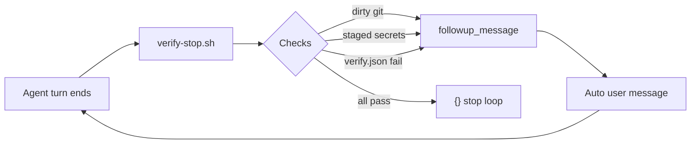

# kleto-go

Cursor app template — reusable starting point for new projects. Always-on rules plus **stop-hook reinforcement loops** so agents micro-commit, run with full access, and pass verification without asking.

## What's included

| Rule / config | Purpose |
|---------------|---------|
| `micro-commits` | Auto-commit each step; one concern; small diffs |
| `git-safety` | Safe git; micro-commit always; push only when asked |
| `allowlist-config` | Valid `cli.json`; global `unrestricted`; why prompts happen |
| `project-full-access` | Every `Shell` uses `required_permissions: ["all"]`; never ask |
| `agent-workflow` | Template rules override conflicting global user rules |
| `coding-principles` | Small diffs, match conventions |
| `verify-before-done` | Run `.cursor/verify.json` commands before claiming done |
| `rule-reinforcement` | How stop-hook loops enforce all template rules |
| `.cursor/cli.json` | Project tool allowlist (`permissions` only — see below) |
| `.cursor/hooks/allow-execution.sh` | IDE: auto-allow shell/MCP; inject `all` on Shell |
| `scripts/setup-cursor-autonomy.sh` | One-time: IDE `permissions.json` + cli-config + Run Everything |
| `scripts/verify-cursor-autonomy.sh` | Verify all autonomy layers after setup |
| `.cursor/verify.json` | Project test/lint commands for the stop hook |
| `.cursor/hooks/verify-stop.sh` | Unified reinforcement loop (git, secrets, verify) |

Rules: [`.cursor/rules/`](.cursor/rules/) (`.mdc`, `alwaysApply: true`).

## Reinforcement architecture



| Check | Enforces |
|-------|----------|
| Git clean | `micro-commits`, `git-safety` |
| Staged secrets scan | `git-safety` |
| `verify.json` commands | `verify-before-done`, `coding-principles` (via tests/lint) |
| Footer checklist | `project-full-access`, all always-on rules |

Rules teach behavior; hooks **prove** it. Add testable policies as verify commands; add subjective policies as rules plus footer reminders.

## Fix permission prompts (allowlist)

**Root causes:** (1) invalid project `cli.json` keys → file ignored; (2) missing `~/.cursor/permissions.json` (IDE allowlist); (3) `yoloEnableRunEverything: false` in IDE storage.

```bash
./scripts/setup-cursor-autonomy.sh   # once per machine
./scripts/verify-cursor-autonomy.sh  # after restart
```

| Layer | Store |
|-------|--------|
| IDE Auto-Run | `~/.cursor/permissions.json` → `approvalMode: unrestricted` |
| IDE Run Everything | `state.vscdb` → `yoloEnableRunEverything: true` |
| CLI | `~/.cursor/cli-config.json` → `approvalMode: unrestricted` |
| Project | `.cursor/cli.json` → `permissions` only |
| Hooks | `allow-execution.sh` + trusted workspace |

Fully **quit and restart Cursor** after setup. In Settings → Agent, confirm **Run Everything** (not Use Allowlist).

## No agent attribution on GitHub

Cursor was adding `Co-authored-by: Cursor <cursoragent@cursor.com>` when `attributeCommitsToAgent` was enabled in `~/.cursor/cli-config.json`.

```bash
./scripts/setup-cursor-autonomy.sh          # sets attribution off
./scripts/verify-cursor-autonomy.sh         # checks config + git history
./scripts/strip-agent-coauthors-from-history.sh  # one-time history cleanup (no remotes)
```

Rule + skill: `no-agent-attribution`, `.cursor/skills/fix-agent-attribution/` — stop hook **auto-rewrites** polluted history when the tree is clean (loop), then verifies.

## Configure verification

Edit `.cursor/verify.json` when you add a stack:

```json
{
  "commands": [
    { "name": "test", "run": "go test ./...", "timeout": 120 },
    { "name": "lint", "run": "npm run lint", "optional": true }
  ]
}
```

## IDE setup (one-time)

1. **Trust this workspace** — project hooks require it.
2. **Auto-run / Run everything** — reduces approval prompts (with `.cursor/cli.json` for CLI).

Reload hooks: save `hooks.json` or restart Cursor.

## Recommended rules to add per app

| When | Rule idea | Loop pairing |
|------|-----------|----------------|
| Go / TS / Python app | `globs: **/*.{go,ts}` stack standards | `go test`, `eslint`, `ruff` in `verify.json` |
| API service | `api-conventions.mdc` | contract tests or `curl` smoke in verify |
| UI app | `ui-patterns.mdc` | `npm run build` + optional e2e |
| Team handoff | `session-handoff.mdc` (alwaysApply) | optional: stop hook reminder if transcript incomplete — subjective only |
| PR flow | `pr-checklist.mdc` (not alwaysApply) | user-triggered; `gh pr checks` in verify when opening PRs |
| Dependencies | `deps-bump.mdc` | lockfile + test command in verify |

Keep each rule file under ~50 lines, one concern. Update `rule_reinforcement_footer` in `hooks/lib/checks.sh` when you add a new **always-on** rule worth repeating in every loop.

## Use as a GitHub template

1. Create a repo from this template.
2. Add app code and fill `.cursor/verify.json`.
3. Add stack-specific rules with `globs` where needed.
4. Keep autonomy + reinforcement hooks unless you intentionally relax them.

## License

Add a license when you publish (e.g. MIT).
