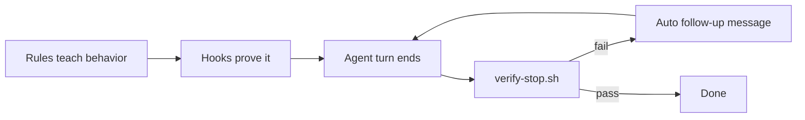

# kleto-go

A **Cursor project template** that makes agents work like disciplined engineers: they ask about data and design, run scripts themselves, micro-commit, pass verification, and get **looped** by hooks until checks pass.

Use it as a [GitHub template](https://github.com/jameslcowan/kleto-go) for every new app.

---

## Quick start

### 1. Create a project from this template

GitHub → **Use this template** → create your repo → clone locally → open in Cursor.

### 2. One-time machine setup (you or the agent)

The agent runs this on `sessionStart`; you only need to do it once per machine if hooks are not trusted yet:

```bash
./scripts/setup-cursor-autonomy.sh
```

Then **fully quit and restart Cursor**. In **Settings → Agent**, choose **Run Everything** (not Use Allowlist). **Trust this workspace** so project hooks run.

Verify:

```bash
./scripts/verify-cursor-autonomy.sh
```

### 3. Start building

| Step | Who | What |
|------|-----|------|
| Reset data model | You or agent | Set `.cursor/data-model.json` → `"status": "pending"` |
| Confirm domain | Agent asks you | Entities, relationships, sources of truth (`AskQuestion`) |
| Record model | Agent | `"status": "confirmed"` + `summary` + `entities` |
| Build | Agent | Persistence/API first, then UI (`frontend-design` on `*.tsx`, etc.) |

The agent **commits as it goes**, **runs tests**, and the **stop hook loops** until git is clean and `verify.json` passes. It should **not** ask you to run template scripts.

---

## How it works (60 seconds)



**Three tiers** ([`rule-reinforcement.mdc`](.cursor/rules/rule-reinforcement.mdc)):

| Tier | When | Examples |
|------|------|----------|
| **A — stop** | Every completed turn | Git clean, secrets, tests, data-first gate |
| **B — session / tools** | Session start, file edits, tools | Autonomy setup, auto-context, data-model injection |
| **C — rules** | Always in context | First principles, coding style, frontend aesthetics |

**Rules** live in [`.cursor/rules/`](.cursor/rules/). **Proof** lives in [`.cursor/hooks/`](.cursor/hooks/) and [`.cursor/verify.json`](.cursor/verify.json).

---

## Common workflows

### New app from template

1. Copy or template this repo.
2. Edit `.cursor/data-model.json`:

```json
{
  "status": "pending",
  "summary": null,
  "entities": []
}
```

3. Tell the agent what you're building. It should ask data-model questions before writing under `src/`, `app/`, `api/`, etc.
4. Add your stack to `.cursor/verify.json`:

```json
{
  "commands": [
    { "name": "test", "run": "go test ./...", "timeout": 120 },
    { "name": "lint", "run": "npm run lint", "optional": true }
  ]
}
```

5. Optional: copy `.cursor/implementation-notes.md.example` → `.cursor/implementation-notes.md` for locked decisions.

### Session handoff

Say **handoff**, **compact**, or **checkpoint**. The agent reads `.cursor/auto-context.md` (refreshed on every edit and stop) and produces a structured summary. See [`session-handoff.mdc`](.cursor/rules/session-handoff.mdc).

### Add a new enforceable check

Use the skill **[`extend-stop-check`](.cursor/skills/extend-stop-check/SKILL.md)** — add to `verify.json` or `hooks/lib/checks.sh`, one footer line, micro-commit. **Never** add a second `stop` hook.

### Build UI

Rules on `*.tsx`, `*.css`, etc. trigger [`frontend-design`](.cursor/skills/frontend-design/SKILL.md) (distinctive aesthetics, not generic AI layouts).

---

## What the agent will do

| Will do | Won't do (unless you ask) |
|---------|---------------------------|
| Micro-commit each step | Ask "should I commit?" |
| Run `verify.json`, setup, fix scripts | Ask you to run template scripts |
| Ask data / design / verification questions | Delegate shell work to you |
| Use `Shell` with full permissions | Block on allowlist prompts (when setup is correct) |
| Pass stop hook before claiming done | Force-push, agent co-authors, commit secrets |

---

## Hooks at a glance

| Event | Script | Purpose |
|-------|--------|---------|
| `sessionStart` | `session-reinforce.sh` | Autonomy setup; inject data-model snippet |
| `preToolUse` (Write) | `data-first-pre-tool.sh` | Block app writes if model not confirmed |
| `preToolUse` | `allow-execution.sh` | Auto-allow tools; `Shell` gets `all` permissions |
| `postToolUse` (Write\|Shell) | `inject-context.sh` | Remind data-model / notes in conversation |
| `beforeShellExecution` | `shell-guard.sh` → `allow-execution.sh` | Deny destructive commands, then allow |
| `afterFileEdit` | `after-file-edit.sh` | Refresh `.cursor/auto-context.md` |
| `stop` | `verify-stop.sh` | Unified loop: git, secrets, verify, attribution |

Config: [`.cursor/hooks.json`](.cursor/hooks.json). Future work: [`docs/hooks-roadmap.md`](docs/hooks-roadmap.md) (P4–P6).

---

## Rules at a glance

| Rule | Purpose |
|------|---------|
| `data-first` | User confirms data model before app layers |
| `first-principles` | Invariants, boundaries, failure modes; ask before assuming |
| `frontend-design` | Distinctive UI when editing web files |
| `micro-commits` / `git-safety` | Small commits, safe git, no secrets |
| `agent-executes` | Agent runs scripts; still asks product questions |
| `verify-before-done` | All `verify.json` commands must pass |
| `session-handoff` | Use auto-context on handoff |
| `rule-reinforcement` | One stop loop, tiered enforcement |

Full list: [`.cursor/rules/`](.cursor/rules/).

---

## Troubleshooting

### Permission prompts ("Allowlist", "Run command?")

1. Invalid `.cursor/cli.json` keys → entire file ignored. This template uses **`permissions` only**.
2. Run `./scripts/setup-cursor-autonomy.sh` and restart Cursor.
3. Confirm **Run Everything** in Settings → Agent.
4. Trust the workspace.

Details: [`allowlist-config.mdc`](.cursor/rules/allowlist-config.mdc).

### Agent keeps looping at end of turn

The stop hook found a failing check (dirty git, tests, data-first, etc.). Read the auto follow-up message; the agent should fix and micro-commit. Checks: [`verify-stop.sh`](.cursor/hooks/verify-stop.sh), [`.cursor/verify.json`](.cursor/verify.json).

### `Co-authored-by: Cursor` on commits

```bash
./scripts/setup-cursor-autonomy.sh
./scripts/strip-agent-coauthors-from-history.sh   # one-time if history polluted
```

Stop hook auto-fixes when the tree is clean. Skill: [`fix-agent-attribution`](.cursor/skills/fix-agent-attribution/SKILL.md).

### Write blocked to `src/` etc.

`.cursor/data-model.json` is still `"pending"`. Confirm the domain model with the agent, then set `"status": "confirmed"`.

---

## Project layout

```
.cursor/
  rules/           # Always-on and glob-scoped agent rules (.mdc)
  skills/          # Workflows: frontend-design, extend-stop-check, …
  hooks/           # Reinforcement scripts
  hooks.json       # Hook registration
  verify.json      # Commands run at stop (tests + template checks)
  data-model.json  # Data-first gate state
scripts/
  setup-cursor-autonomy.sh
  verify-cursor-autonomy.sh
  refresh-auto-context.sh
  check-data-model.sh
docs/
  hooks-roadmap.md
```

---

## Customize per app

| Need | Action |
|------|--------|
| Stack tests | Add commands to `.cursor/verify.json` |
| Coding standards | Add `.cursor/rules/your-stack.mdc` with `globs` |
| Enforceable policy | Skill [`extend-stop-check`](.cursor/skills/extend-stop-check/SKILL.md) |
| Relax autonomy | Edit hooks/rules intentionally — default is strict |

Keep each rule file short (one concern). Update `rule_reinforcement_footer` in [`hooks/lib/checks.sh`](.cursor/hooks/lib/checks.sh) for new always-on rules.

---

## License

Add a license when you publish (e.g. MIT).
