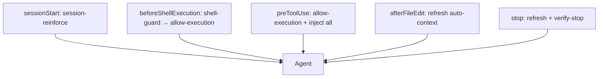

# Hooks roadmap (kleto-go)

Scalped patterns from community repos, adapted to kleto-go’s **one stop loop** + tiered reinforcement.

## Backlog

| ID | Item | Tier | Status | Source inspiration |
|----|------|------|--------|-------------------|
| P0 | Shell guard on `beforeShellExecution` (deny destructive commands) | Hook A′ | **Done** | [cursor-agent-learning](https://github.com/wchen02/cursor-agent-learning), [endorlabs/cursor-hook-examples](https://github.com/endorlabs/cursor-hook-examples) |
| P1 | Auto-context snapshot on `afterFileEdit` + `stop` | Hook B | **Done** | [cursor-setup-guide](https://github.com/Wade-O-Lution-Inc/cursor-setup-guide) |
| P1b | `session-handoff` rule → read `.cursor/auto-context.md` | Rule C | **Done** | Same |
| P2 | `preToolUse` / `postToolUse` inject data-model + notes | Hook B | Planned | [planning-with-files](https://github.com/OthmanAdi/planning-with-files) |
| P3 | Skill `extend-stop-check` (add verify + checks.sh line) | Skill | Planned | [claude-code plugin-dev](https://github.com/anthropics/claude-code/tree/main/plugins/plugin-dev) |
| P4 | Optional `task_plan.md` + stop phase check (opt-in file) | Hook A | Planned | planning-with-files |
| P5 | `subagentStop` parent followup when using Task tool | Hook | Planned | [cursor-handbook hooks](https://github.com/girijashankarj/cursor-handbook/blob/main/docs/cursor-guidelines/chapters/06-hooks.md) |
| P6 | Optional `.cursor/decisions.json` gate (first-principles artifact) | Hook A | Planned | kleto-go (mirror data-first) |

**Do not import:** full [cursor-handbook](https://github.com/girijashankarj/cursor-handbook) rule packs, multi-agent agile generators, or second `stop` hooks per rule.

## Implementation plan (P0 + P1)

### P0 — Shell guard

1. Add `.cursor/hooks/shell-guard.sh` — read `command` from hook JSON; deny with `permission: deny` + `agent_message` (stdout) or exit 2.
2. Patterns aligned with `git-safety.mdc`: force-push to main/master, `reset --hard`, `rm -rf /`, pipe-to-shell, fork bomb, `git config` writes.
3. Register **before** `allow-execution.sh` in `hooks.json` `beforeShellExecution` (guard → allow).
4. Document in README + `rule-reinforcement.mdc`; verify in `scripts/verify-cursor-autonomy.sh`.

### P1 — Auto-context

1. Add `scripts/refresh-auto-context.sh` — write `.cursor/auto-context.md` (branch, HEAD, status, log, diff stat, data-model header).
2. Add `.cursor/hooks/after-file-edit.sh` — observation hook (`{}`); calls refresh.
3. Call refresh at start of `verify-stop.sh` when `status=completed`.
4. Add `session-handoff.mdc` (always-on, short): on handoff/compact keywords, read auto-context first.
5. Gitignore `.cursor/auto-context.md` (machine-generated).

### Verification

```bash
chmod +x .cursor/hooks/shell-guard.sh .cursor/hooks/after-file-edit.sh scripts/refresh-auto-context.sh
./scripts/test-shell-guard.sh
./scripts/verify-cursor-autonomy.sh
```

`shell-guard` is also in `.cursor/verify.json` (stop loop).

## Hook event map (after P0+P1)


